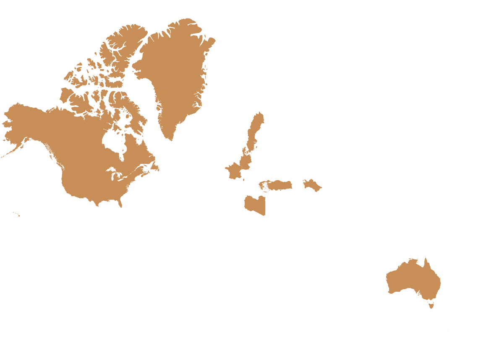

# MyScratchMap
MyScratchMap is a Svelte-powered interactive world map application built on [jsVectorMap](https://jsvectormap.com/). It allows you to mark countries as **Visited**, **Planned**, or **Banned** by clicking on them. You can also search for countries, reset the map, export your data in multiple formats, and share your custom map with others.


## Features

1. **Interactive World Map**  
   - Click on any country to cycle through statuses: **Visited** → **Planned** → **Banned** → **None**.
   - Custom color scheme for each status:
     - **Visited**: Orange
     - **Planned**: Light Orange
     - **Banned**: Black
     - **None** (default): White

2. **Real-Time Data Handling**  
   - Automatically saves your status selections in `localStorage`.
   - URL-based sharing: Compresses the status data and embeds it in the URL. Anyone opening that link sees your marked map.

3. **Search & Filter**  
   - Quickly search and filter countries in the sidebar list.
   - Click a filtered country name to cycle its status.

4. **Data Export**  
   - Export your marked countries in CSV, JSON, or TXT formats.
   - Save your map as a PNG image.

5. **Reset**  
   - Clear all marked countries and restore the map to the default state.

## Usage

1. **Click a country on the map** to toggle through statuses:
   - 1st click: **Visited**
   - 2nd click: **Planned**
   - 3rd click: **Banned**
   - 4th click: **None** (removes the status)

2. **Search** for countries in the sidebar:
   - As you type in the search box, the list updates to show matching countries.
   - Clicking a country name in the list toggles its status on the map.

3. **Reset Map**:
   - Click the **Reset Map** button to remove all statuses and clear localStorage.

4. **Export Data**:
   - **Save as PNG**: Downloads a snapshot of the map as a PNG file.
   - **Save as CSV**, **JSON**, or **TXT**: Exports your marked countries and their statuses.

5. **Share Link**:
   - Click **Share Link** to copy a custom URL.  
   - Anyone who opens it sees the same marked map.
  
## Installation & Setup

1. **Clone the repository**:
   ```bash
   git clone https://github.com/Berkanktk/MyScratchMap.git
   ```
2. **Navigate to the project folder**:
   ```bash
   cd MyScratchMap
   ```
3. **Install dependencies**:
   ```bash
   npm install
   ```
4. **Run the development server**:
   ```bash
   npm run dev
   ```
   - By default, the app should be accessible at `http://localhost:5173/` (depending on your setup).

5. **Open your browser**:  
   - Visit the local URL provided in your terminal to see the map.

## Project Structure

```
MyScratchMap/
│
├─ src/
│  ├─ App.svelte            # Example main Svelte component (imports your map component)
│  ├─ MyScratchMap.svelte   # Core map UI and logic
│  ├─ Footer.svelte         # Footer component
│  └─ ...
├─ public/
│  ├─ world_merc_en.js      # Data for jsVectorMap's "world" map
│  └─ ...
├─ package.json
├─ tsconfig.json
├─ vite.config.js
└─ ...
```

## Customization
- **Colors**:  
  Modify the `modeColors` and `listColors` objects in the Svelte file to suit your design.

- **Map Configuration**:  
  Tweak the `jsVectorMap` options within the `loadMap()` function (zoom behavior, tooltip, etc.) in `MyScratchMap.svelte`.

## Links & Documentation
[jvectormap](https://github.com/bjornd/jvectormap) - jQuery Vector Map Library  
[jsvectormap](https://github.com/themustafaomar/jsvectormap) - javascript Vector Map Library  
[jsvectormap Docs](https://jvm-docs.vercel.app/docs/introduction) - javascript Vector Map Library Docs  
[Maps and Country codes](https://gist.github.com/paulsheldrake/69d8817ab616aa81919b9dc438359ccf) - Country codes and maps

## License

This project is licensed under the **MIT License**.  
See the [LICENSE](LICENSE) file for more details.